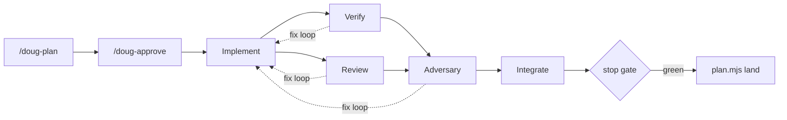

# Doug

[](https://github.com/eschwa3/dougharness/actions/workflows/ci.yml)
[](https://www.npmjs.com/package/@dougharness/cli)

Plan, approve, run, gate: guardrails for Claude Code that check the agent's work instead of trusting its word.

Left alone, an agent drifts from the spec, skips the tests it should have run, and reports "done" on work that isn't. Doug's plan is written first, deterministic hooks (small scripts Claude Code runs automatically around every action) block on broken or untested work, and a second model argues against the first before anything lands.



## Why Doug

- **Nothing lands without your yes.** A change becomes a written plan first; `plugins/doug-flow/workflows/doug-implement.js` refuses to run an unapproved plan, and `/doug-approve` (`plan.mjs approve`) is what approves one.
- **A turn blocks on broken or untested work, up to a cap.** The stop gate runs typecheck and tests before Claude's turn finishes and blocks it while they fail, or while the session never ran a check itself, for up to 3 blocks in a row (each subagent counted separately; the count resets on a green gate); past that, or on the gate's own crash or timeout, it stands down and fails open (`plugins/doug-gates/scripts/stop-gate.mjs`).
- **The model can't edit its way around the rules.** `.env` files, the lockfile, migrations, and anything outside the project are denied at the edit itself (`plugins/doug-gates/scripts/protect-paths.mjs`).
- **A second, different model argues against the first.** After review, `codex-review` re-reads the diff on Codex and tries to refute it; a blocker keeps the change out (`packages/doug-codex`). Codex is optional: without `@dougharness/codex` and the Codex CLI installed, the Claude `adversary-claude` agent stands in instead.
- **It remembers what went wrong before.** Past lessons are recalled by keyword (semantic recall with `memory.embeddings` set) and put in front of the next task before it starts (`plugins/doug-flow/lib/memory.mjs`).

## Quickstart

```sh
claude plugin marketplace add eschwa3/dougharness
claude plugin install doug-gates@dougharness
claude plugin install doug-flow@dougharness
npx @dougharness/cli init .
```

Open Claude Code in the repo and run `/doug-plan <what you want built>`: it plans, you approve with `/doug-approve`, and `/doug-implement` runs it. See [docs/getting-started.md](docs/getting-started.md) for the global install and the Codex adversary, and [docs/onboarding.md](docs/onboarding.md) for the board and `/doug-next`.

## Docs

- [docs/reference.md#install-from-a-clone](docs/reference.md#install-from-a-clone) — contributing from a clone
- [docs/reference.md#onboarding](docs/reference.md#onboarding) — `pnpm bootstrap` and first project setup
- [docs/reference.md#gates](docs/reference.md#gates) — every hook, what it checks, and its config
- [docs/reference.md#the-flow](docs/reference.md#the-flow) — plan, approve, implement, swarm, land
- [docs/reference.md#the-board](docs/reference.md#the-board) — the card queue and its commands
- [docs/reference.md#status-line](docs/reference.md#status-line) — the status line segments
- [docs/reference.md#the-worker-contract](docs/reference.md#the-worker-contract) — the adapter interface, `codex-review`
- [docs/reference.md#layout](docs/reference.md#layout) — what lives where in the repo
- [docs/reference.md#measured](docs/reference.md#measured) — every number Doug has actually measured
- [docs/getting-started.md](docs/getting-started.md) — the full install and first-run walkthrough
- [docs/onboarding.md](docs/onboarding.md) — what `doug init` writes and never does
- [docs/board.md](docs/board.md) — the board's schema
- [docs/memory.md](docs/memory.md) — lesson recall, the code index, and the decision/rule proposal path
- [docs/worker-contract.md](docs/worker-contract.md) — what every worker must return

## Principles

1. Native first. If Claude Code has a primitive, use it.
2. Enforce with hooks, advise with markdown.
3. Deterministic before probabilistic. The model drafts; code decides.
4. Honest by construction. Every number a user sees is measured or absent.
5. Fresh context per task, state in files.
6. Nothing runs unless asked. No daemon, no auto-update, no telemetry.
7. Measured, not marketed.

## License

MIT. See [LICENSE](LICENSE).
